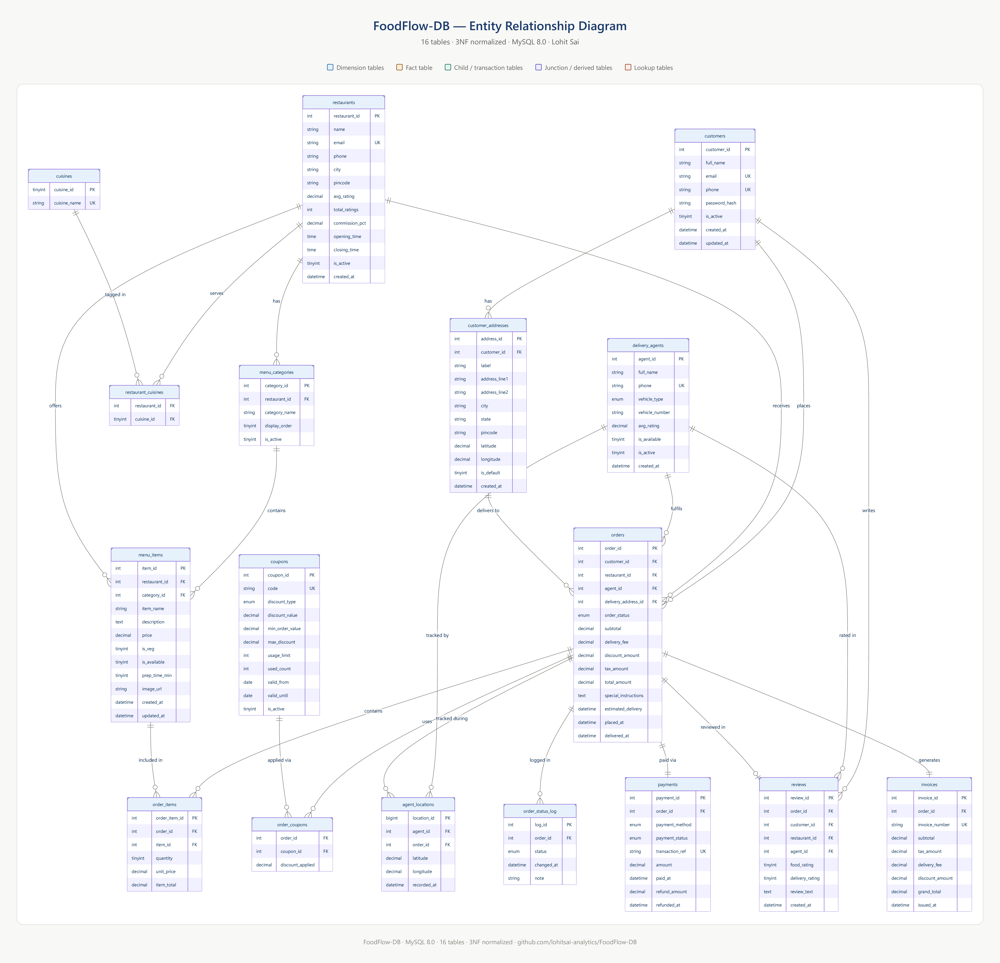

# FoodFlow-DB — Production-Grade Food Delivery Database System
### MySQL 8.0 · 16 Tables · Full Order Lifecycle · Business Logic at Database Layer

<p align="left">
  
  
  
  
  
  
</p>

> **Most database projects stop at the schema. This one doesn't.** FoodFlow-DB implements triggers, stored procedures, audit logging, and a full analytical SQL layer — enforcing business rules at the database level, not the application layer.

---

## Table of Contents

- [What Makes This Different](#what-makes-this-different)
- [System Scope](#system-scope)
- [Entity Relationship Diagram](#entity-relationship-diagram)
- [Data Architecture](#data-architecture)
- [Schema Design Decisions](#schema-design-decisions)
- [Database Logic](#database-logic)
- [Analytical Layer](#analytical-layer)
- [Project Structure](#project-structure)
- [How to Run](#how-to-run)
- [Known Gaps and Potential Improvements](#known-gaps-and-potential-improvements)
- [Skills Demonstrated](#skills-demonstrated)

---

## What Makes This Different

Most student database projects create a schema and stop. This project goes three layers deeper:

| Layer | What Most Projects Do | What FoodFlow-DB Does |
|---|---|---|
| **Schema** | Create tables with PKs | 3NF normalized, 16 tables, FK constraints, junction tables |
| **Business Logic** | Leave to the application | 6 triggers + stored procedures enforce rules at DB level |
| **Data Integrity** | Hope the app handles it | Immutable audit log, snapshot pricing, transaction-safe procedures |
| **Analytics** | Write a few SELECT queries | Window functions, Pareto analysis, cohort segmentation, LTV |

The core design philosophy: **if the application crashes, the database must still be consistent.**

---

## System Scope

FoodFlow-DB models the complete lifecycle of a food delivery platform — from customer registration to post-delivery review — across 7 operational domains:

```
Customer          Restaurant         Order              Delivery
Management   →    Operations    →    Lifecycle    →    Tracking
  |                   |                  |                 |
Address           Dynamic Menu      Payment           Agent GPS
Management        Management        Processing        Logging
                                        |
                                    Invoice
                                  Generation
                                        |
                                   Review &
                                   Rating
                                   System
                                        |
                                  Analytics
                                    Layer
```

Every domain is connected through enforced FK relationships — there are no orphaned records, no inconsistent states, and no data that can exist without a valid parent.

---

## Entity Relationship Diagram



### Table Inventory (16 tables)

| Domain | Tables |
|--------|--------|
| Customer Management | `customers`, `customer_addresses` |
| Restaurant Operations | `restaurants`, `menu_categories`, `menu_items` |
| Order Processing | `orders`, `order_items`, `order_status_log` |
| Payment & Invoicing | `payments`, `invoices`, `coupons`, `coupon_usage` |
| Delivery | `delivery_agents`, `deliveries`, `agent_locations` |
| Reviews | `reviews` |

---

## Data Architecture

### Normalization: Third Normal Form (3NF)

The schema eliminates all three categories of data anomaly:

**No partial dependencies (1NF → 2NF):**
Every non-key attribute depends on the entire primary key — not just part of it. In `order_items`, the item price is stored per order line, not referenced from the live menu price. If the restaurant changes a menu item price tomorrow, historical orders are unaffected.

**No transitive dependencies (2NF → 3NF):**
Customer city and state are stored in `customer_addresses`, not denormalized into `orders`. Restaurant city is stored in `restaurants`, not repeated in every order row. No non-key column determines another non-key column.

**Junction tables for many-to-many relationships:**
`coupon_usage` resolves the many-to-many between customers and coupons. `order_items` resolves the many-to-many between orders and menu items. No array columns, no JSON blobs, no comma-separated IDs.

### OLTP and Analytical Dual Optimization

The schema is optimized for **both** workload types simultaneously:

For OLTP (high-frequency writes): BIGINT primary keys on `agent_locations` support high-frequency GPS inserts without index fragmentation. Triggers maintain pre-computed aggregates (`avg_rating`) so real-time reads never hit expensive aggregation queries.

For Analytics (complex reads): Denormalized snapshot values in `orders` (subtotal, tax, discount, total) mean revenue analytics never need to re-join to pricing tables or apply historical tax rules — the correct value at order time is permanently stored.

---

## Schema Design Decisions

### Decision 1 — Financial Snapshot Modeling

```sql
-- In the orders table:
subtotal        DECIMAL(10,2) NOT NULL,
discount_amount DECIMAL(10,2) DEFAULT 0.00,
tax_amount      DECIMAL(10,2) NOT NULL,
total_amount    DECIMAL(10,2) NOT NULL
```

**Why:** If `menu_items.price` changes after an order is placed, a naive schema joining orders to live menu prices returns wrong historical revenue. Storing the financial values at order time creates an immutable financial record — the same pattern used in production e-commerce systems.

**What this prevents:** Revenue reports that change retroactively when restaurant owners update their menus.

---

### Decision 2 — Materialized Rating Aggregates

```sql
-- In restaurants table:
avg_rating DECIMAL(3,2) DEFAULT 0.00

-- Maintained by trigger, not computed at query time:
AFTER INSERT ON reviews
  SET NEW.avg_rating = (SELECT AVG(rating) FROM reviews WHERE restaurant_id = NEW.restaurant_id)
```

**Why:** `SELECT AVG(rating) FROM reviews WHERE restaurant_id = X` on a large platform means scanning thousands of rows per restaurant per page load. Pre-computing and maintaining the aggregate via trigger reduces that to a single row lookup — O(1) instead of O(n).

**What this prevents:** Full table scans on `reviews` for every restaurant listing request.

---

### Decision 3 — Immutable Order Audit Log

```sql
-- order_status_log captures every state transition:
order_id        INT NOT NULL,
old_status      ENUM(...),
new_status      ENUM(...),
changed_at      TIMESTAMP DEFAULT CURRENT_TIMESTAMP,
changed_by      VARCHAR(100)
```

**Why:** In distributed systems, orders can transition through states from multiple services — the app server, the payment gateway, the delivery service. Without an audit log, there is no way to reconstruct what happened when an order gets stuck or a payment is disputed.

**What this enables:** Full lifecycle reconstruction, SLA breach analysis, dispute resolution, and customer support tooling — all from pure SQL.

---

### Decision 4 — High-Frequency GPS Table Design

```sql
CREATE TABLE agent_locations (
    location_id BIGINT PRIMARY KEY AUTO_INCREMENT,  -- BIGINT not INT
    agent_id    INT NOT NULL,
    latitude    DECIMAL(10,8) NOT NULL,
    longitude   DECIMAL(11,8) NOT NULL,
    recorded_at TIMESTAMP DEFAULT CURRENT_TIMESTAMP
);
```

**Why BIGINT:** A platform with 500 active delivery agents each reporting GPS every 30 seconds generates 1,000 inserts per minute — 1.44M rows per day. INT primary keys overflow at ~2.1 billion rows. BIGINT supports up to 9.2 quintillion rows — future-safe for any realistic scale.

**Why DECIMAL(10,8) for coordinates:** GPS latitude requires 8 decimal places for ~1mm precision. FLOAT truncates silently and introduces rounding errors in distance calculations. DECIMAL is exact.

---

## Database Logic

### Triggers (6 Implemented)

All six triggers enforce business rules that must hold regardless of which application, API, or admin tool touches the database.

| Trigger | Event | Action |
|---------|-------|--------|
| `trg_log_status_change` | `AFTER UPDATE` on `orders` | Writes every status transition to `order_status_log` |
| `trg_generate_invoice` | `AFTER UPDATE` on `orders` (status = delivered) | Auto-creates invoice record on delivery confirmation |
| `trg_update_restaurant_rating` | `AFTER INSERT` on `reviews` | Recalculates and updates `restaurants.avg_rating` |
| `trg_update_agent_rating` | `AFTER INSERT` on `reviews` | Recalculates and updates `delivery_agents.avg_rating` |
| `trg_track_coupon_usage` | `AFTER INSERT` on `orders` | Logs coupon redemption and increments usage counter |
| `trg_set_delivery_timestamp` | `AFTER UPDATE` on `deliveries` | Records `delivered_at` timestamp when status transitions to delivered |

**The key design principle:** these triggers fire at the database engine level — they cannot be bypassed by a buggy API, a direct SQL client connection, or a batch import script. The rules hold unconditionally.

---

### Stored Procedures

#### `sp_place_order` — Transaction-Safe Order Creation

This procedure handles the most complex operation in the system — placing an order — as a single atomic transaction.

```sql
CALL sp_place_order(
    p_customer_id,
    p_restaurant_id,
    p_items JSON,          -- array of {menu_item_id, quantity}
    p_coupon_code,
    p_payment_method
);
```

Internal execution sequence:
1. Validate restaurant is currently open and accepting orders
2. Parse item list — verify each menu item belongs to the specified restaurant
3. Calculate subtotal from snapshot prices (not live menu prices)
4. Validate and apply coupon — check expiry, minimum order value, usage limits
5. Calculate tax amount based on restaurant tax configuration
6. Calculate final total
7. `START TRANSACTION` — insert `orders`, `order_items`, `payments` atomically
8. Fire coupon usage trigger
9. `COMMIT` — or `ROLLBACK` on any failure with descriptive error message

**Why this matters:** Without a stored procedure, placing an order requires 4–6 separate INSERT statements from the application. If the app crashes between statements 3 and 4, the database has a partial order — paid but with no items, or with items but no payment record. The stored procedure makes all-or-nothing the only possible outcome.

---

#### `sp_update_order_status` — Validated State Machine

```sql
CALL sp_update_order_status(p_order_id, p_new_status, p_updated_by);
```

Valid state transitions enforced:

```
pending → confirmed → preparing → ready_for_pickup → out_for_delivery → delivered
    |                                                                        |
    └──────────────────────── cancelled ←────────────────────────────────────
```

The procedure rejects any transition that skips a step or attempts an impossible reversal — an order that is already `delivered` cannot be moved to `preparing`. These constraints exist in the database, not just in the frontend form validation.

---

## Analytical Layer

`04_analytics_queries.sql` implements production-level SQL analytics across four domains.

### Revenue Analytics

```sql
-- Monthly Revenue with Month-over-Month Growth
SELECT
    DATE_FORMAT(created_at, '%Y-%m') AS month,
    SUM(total_amount)                AS revenue,
    LAG(SUM(total_amount)) OVER (ORDER BY DATE_FORMAT(created_at, '%Y-%m')) AS prev_month,
    ROUND(
        (SUM(total_amount) - LAG(SUM(total_amount)) OVER (ORDER BY DATE_FORMAT(created_at, '%Y-%m')))
        / LAG(SUM(total_amount)) OVER (ORDER BY DATE_FORMAT(created_at, '%Y-%m')) * 100, 2
    ) AS mom_growth_pct
FROM orders
WHERE status = 'delivered'
GROUP BY month
ORDER BY month;
```

Additional revenue queries: restaurant contribution with platform commission calculation, Pareto analysis identifying the top restaurants generating 80% of revenue, revenue breakdown by payment method.

---

### Customer Analytics

```sql
-- Customer Segmentation: One-Time vs Repeat Buyers
SELECT
    customer_id,
    COUNT(order_id)                                  AS total_orders,
    SUM(total_amount)                                AS lifetime_value,
    MIN(created_at)                                  AS first_order,
    MAX(created_at)                                  AS last_order,
    DATEDIFF(MAX(created_at), MIN(created_at))       AS customer_lifespan_days,
    CASE WHEN COUNT(order_id) = 1 THEN 'One-Time' ELSE 'Repeat' END AS segment
FROM orders
WHERE status = 'delivered'
GROUP BY customer_id;
```

Additional customer queries: average days between repeat purchases (return window analysis), LTV distribution by customer segment, cohort analysis by registration month.

---

### Operations Analytics

```sql
-- On-Time vs Delayed Delivery Impact on Review Scores
SELECT
    CASE
        WHEN d.delivered_at <= o.estimated_delivery THEN 'On-Time'
        ELSE 'Delayed'
    END                           AS delivery_status,
    COUNT(*)                      AS order_count,
    ROUND(AVG(r.rating), 2)       AS avg_review_score,
    ROUND(AVG(TIMESTAMPDIFF(MINUTE, d.picked_up_at, d.delivered_at)), 0) AS avg_delivery_minutes
FROM deliveries d
JOIN orders o      ON d.order_id = o.order_id
JOIN reviews r     ON o.order_id = r.order_id
GROUP BY delivery_status;
```

Additional operations queries: delivery agent performance leaderboard (orders completed, avg rating, avg delivery time), order funnel conversion rates (placed → confirmed → delivered), SLA breach analysis using `order_status_log`.

---

### Product Analytics

Top-selling menu items by volume and revenue, vegetarian vs non-vegetarian order distribution, category-level performance, menu items ordered together (frequently bought together analysis using self-join on `order_items`).

---

## Project Structure

```
FoodFlow-DB/
|
+-- README.md
|
+-- 01_schema/
|   +-- 01_schema.sql              Table definitions, constraints, indexes
|
+-- Procedures/
|   +-- 02_triggers_procedures.sql  All 6 triggers + stored procedures
|
+-- Data/
|   +-- 03_seed_data.sql           Realistic test data for all 16 tables
|
+-- Analytics/
|   +-- 04_analytics_queries.sql   Revenue, customer, operations, product queries
|
+-- Docs/
    +-- erd_diagram.png            Full entity-relationship diagram
```

---

## How to Run

### Prerequisites

- MySQL 8.0 or higher
- MySQL Workbench (recommended) or any MySQL client

### Setup — 4 steps, in order

```sql
-- Step 1: Create and select the database
CREATE DATABASE foodflow_db;
USE foodflow_db;

-- Step 2: Build the schema (all 16 tables + constraints)
SOURCE 01_schema/01_schema.sql;

-- Step 3: Create triggers and stored procedures
SOURCE Procedures/02_triggers_procedures.sql;

-- Step 4: Load seed data
SOURCE Data/03_seed_data.sql;
```

### Test the system

```sql
-- Place a test order using the stored procedure
CALL sp_place_order(1, 1, '[{"menu_item_id": 3, "quantity": 2}]', 'SAVE10', 'credit_card');

-- Check the audit log was auto-populated
SELECT * FROM order_status_log ORDER BY changed_at DESC LIMIT 10;

-- Update order status through the state machine
CALL sp_update_order_status(1, 'confirmed', 'system');
CALL sp_update_order_status(1, 'preparing', 'restaurant_app');

-- Run the analytics layer
SOURCE Analytics/04_analytics_queries.sql;
```

---

## Known Gaps and Potential Improvements

This section exists because real engineers document limitations — not just capabilities.

### Current Gaps

| Gap | Why It Exists | Production Solution |
|-----|--------------|---------------------|
| No table partitioning | Out of scope for v1 | Partition `orders` and `agent_locations` by date range |
| No indexing strategy document | Implicit indexes only | Add composite indexes on high-frequency query columns |
| No role-based access control | Single-user schema | Add MySQL user roles: `app_user`, `analytics_user`, `admin` |
| No API integration | Pure database layer | Add REST API layer (FastAPI or Node.js + Express) |
| No caching layer | Direct DB queries | Add Redis for `avg_rating` and menu item lookups |
| No event streaming | Synchronous triggers | Replace some triggers with Kafka events for async processing |

### Priority Improvements for v2

**Indexing strategy** — the highest-impact addition:
```sql
-- Queries that currently do full scans and need composite indexes:
CREATE INDEX idx_orders_customer_status ON orders(customer_id, status);
CREATE INDEX idx_orders_restaurant_date ON orders(restaurant_id, created_at);
CREATE INDEX idx_agent_locations_agent_time ON agent_locations(agent_id, recorded_at);
CREATE INDEX idx_reviews_restaurant ON reviews(restaurant_id, rating);
```

**Order table partitioning** — for datasets exceeding ~10M rows:
```sql
ALTER TABLE orders PARTITION BY RANGE (YEAR(created_at)) (
    PARTITION p2023 VALUES LESS THAN (2024),
    PARTITION p2024 VALUES LESS THAN (2025),
    PARTITION p_future VALUES LESS THAN MAXVALUE
);
```

---

## Skills Demonstrated

| Skill Area | Specific Demonstration |
|---|---|
| **Relational Modeling** | 3NF normalization, junction tables, FK cascade rules |
| **Constraint Design** | PK, FK, UNIQUE, CHECK, DEFAULT, NOT NULL used purposefully |
| **Transaction Safety** | `START TRANSACTION / COMMIT / ROLLBACK` in stored procedures |
| **Trigger Engineering** | Event-driven automation without application dependency |
| **State Machine Design** | Validated order status transitions in `sp_update_order_status` |
| **Audit Trail Design** | Immutable `order_status_log` for full lifecycle reconstruction |
| **Advanced SQL** | Window functions (LAG, ROW_NUMBER), CTEs, self-joins, CASE logic |
| **Performance Thinking** | Materialized aggregates, BIGINT GPS keys, snapshot pricing |
| **System Architecture** | Business logic enforced at DB layer, not UI layer |
| **Engineering Honesty** | Known gaps documented with production solutions |

---

## Author

**Lohit Sai** — Data Analyst

[FoodFlow-DB](https://github.com/lohitsai-analytics/FoodFlow-DB) | [Patient Readmission Project](https://github.com/lohitsai-analytics/Patient-Readmission-Risk-Analysis) | [Olist E-Commerce Project](https://github.com/lohitsai-analytics/Olist-ECommerce-Analytics) | [GitHub Profile](https://github.com/lohitsai-analytics)

---

*If this project was useful, consider giving it a star*
